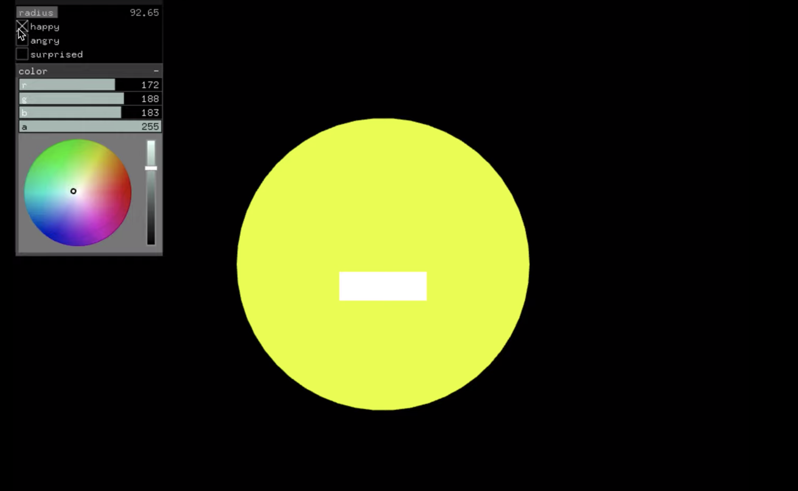
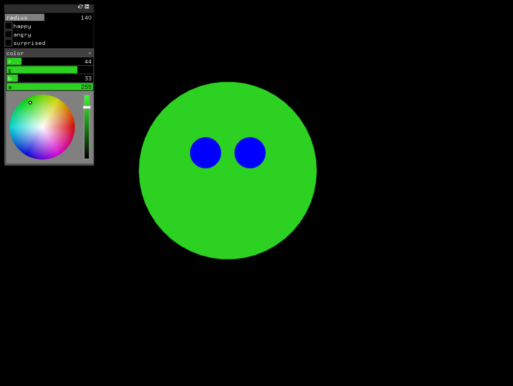
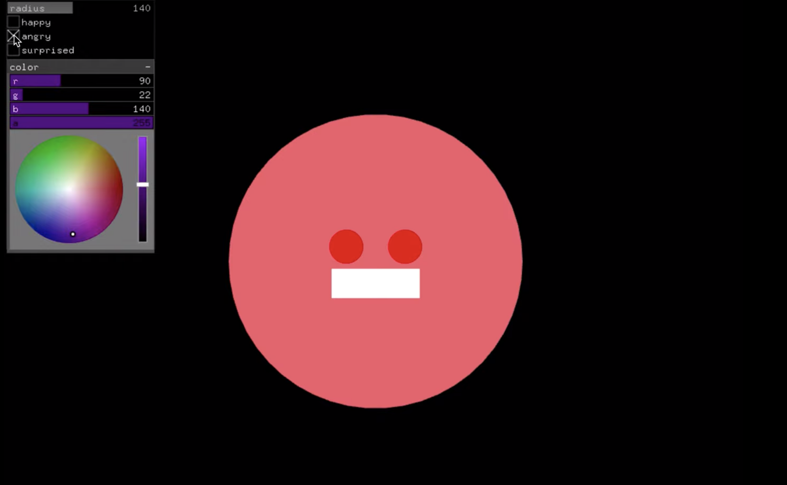
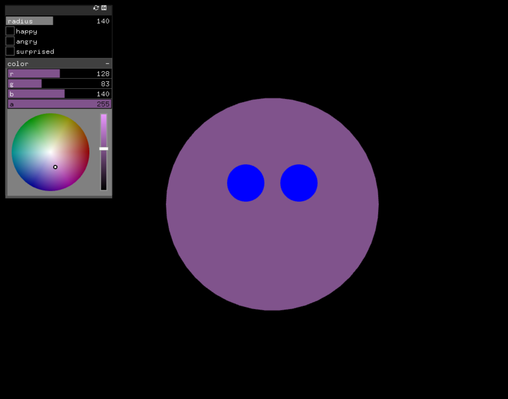
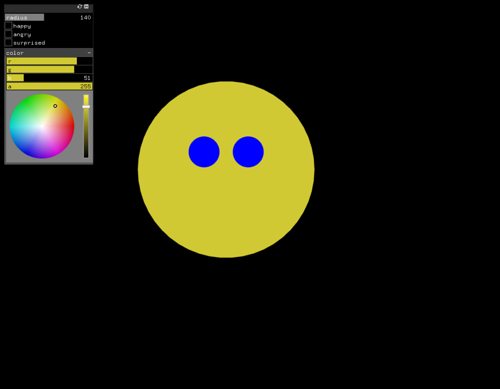

## Assignment 7:UI & oFx Matrix

### Description

This is a UI with sliders and buttons for the expressions assignment. There is an ofxFloatSlider to control the sound volume,  ofxButton to rotate between which emotion is being displayed, ofxVec2Slider to change the x,y of all shapes being drawn, ofxColorSlider to select the color of one shape in the drawing, and ofxIntSlider shape movement (degree of emotion).

### Images 

### Video

