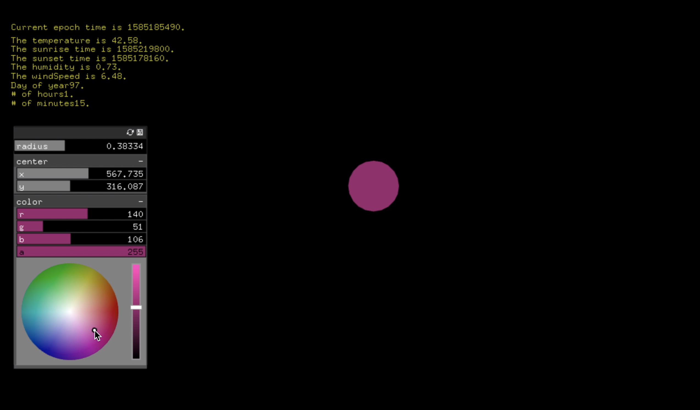
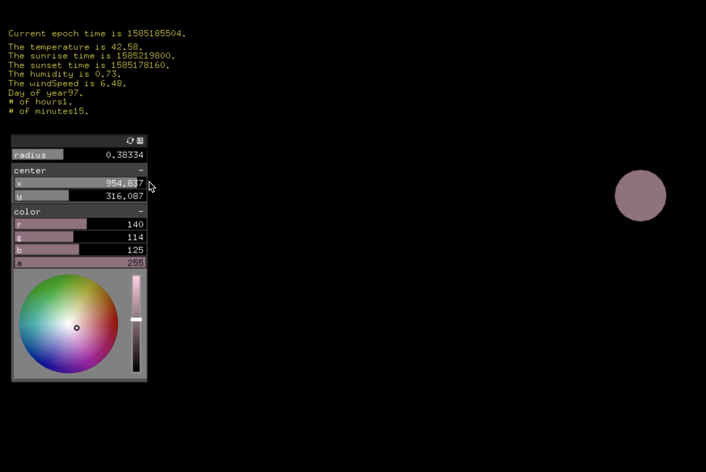
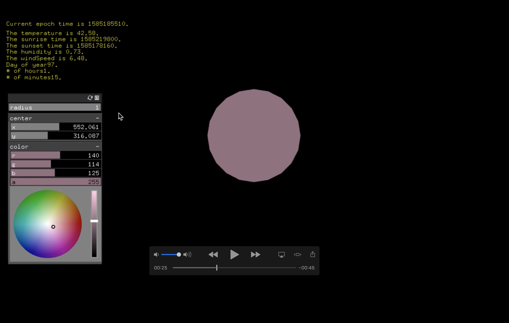
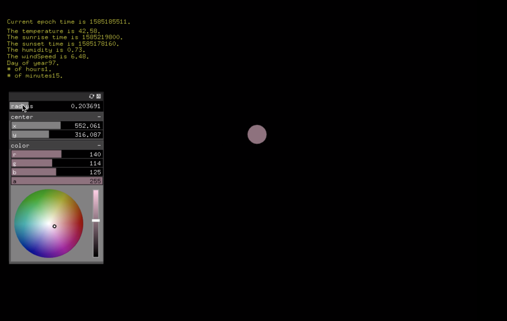
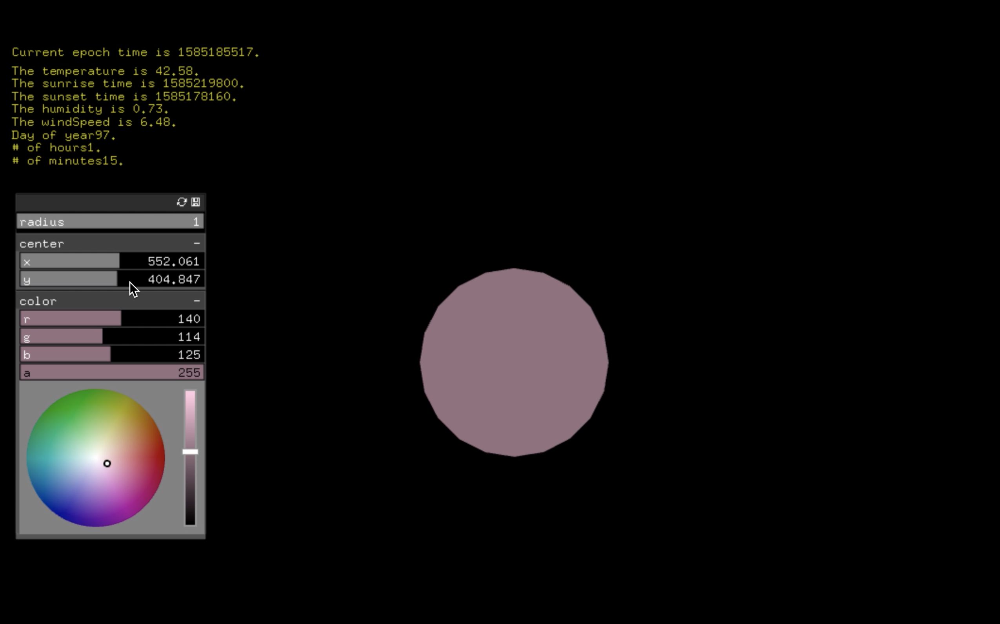

## Project Two: Darksky API

### Description

Using Darksky API data, this project reports weather data for London, within the window the time (in epoch format), sunriseTime, sunsetTime, temperature,humidity, and windSpeed are printed. The current day of the year, hour, and minute are also shown.

If it is between Sunset and Sunrise time in London, a blue moon appears. 
If it is between Sunrise and Sunset, a sun appears. 
Both the sun and the moon's colors can be adjusted using the color GUI slider. 

All of the following values can be changed manually with the GUI panel, and change automatically according to the corresponding API data for each value:

The temperature changes the color.
The humidity changes the radius of the circle.
The windSpeed (multiplied by 100) is shown to effect the circle center point location.

Y = vertical location 
X = horizontal location (Sunrise time) 
 

### Images 

### Video

