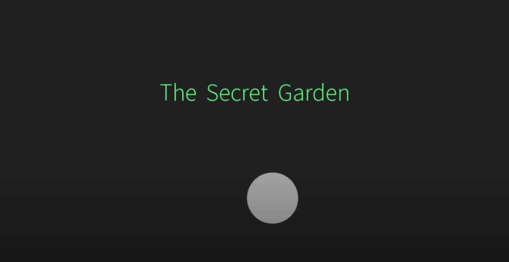
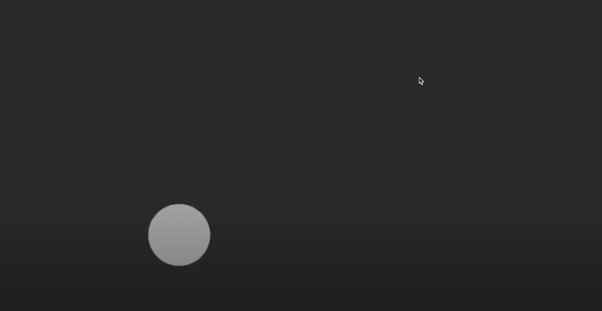
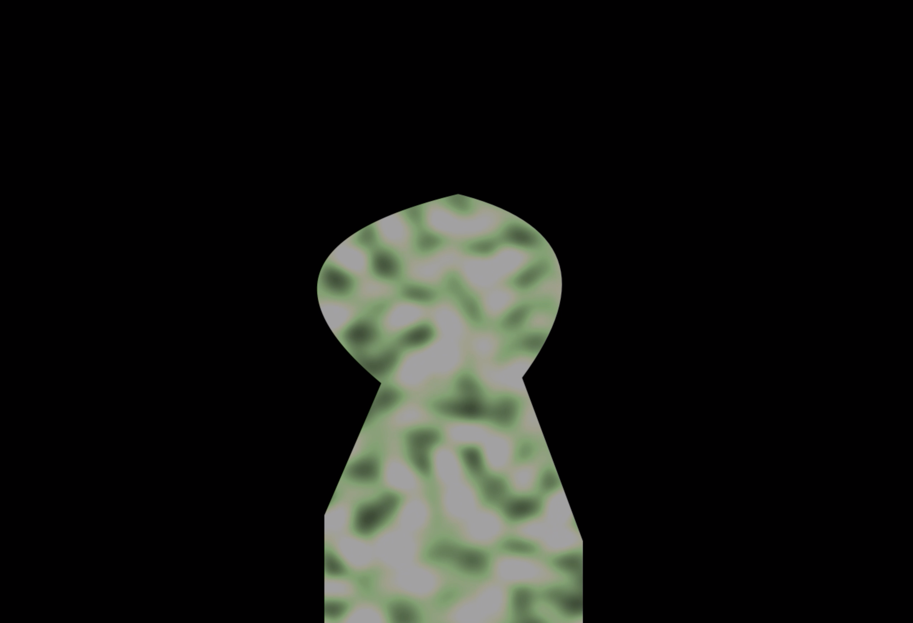
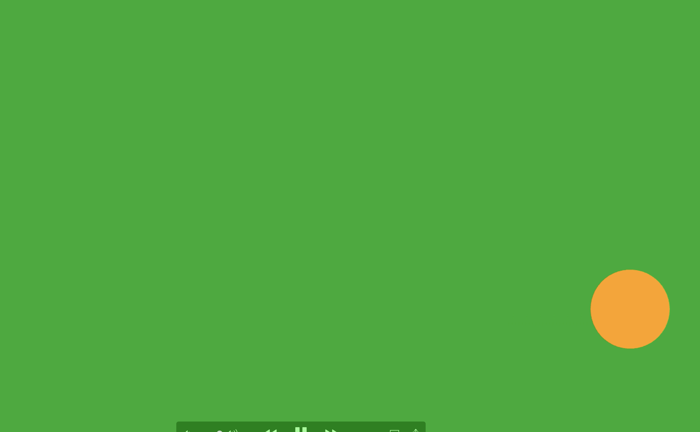
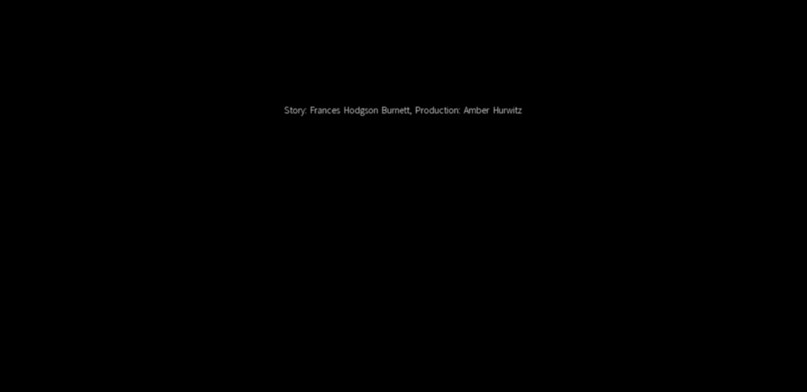

# Project One: Story

### Description of Project Concept

My project conept is an abstracted visualization of the story of The Secret Garden. I want to make the whole project somewhat abstract, to tell the story primarily through color and somewhat warped or abstracted shapes.

The main character is represented by a circle, which starts out as grey, to represent her illness and mood.  The first scene will have a dark grey and black background and color palette. It will include dark clouds, and ominous illustration.

The circle (main character) finds a door/gate in the second scene, and a view through a keyhole reveals a world of color. The ominous or minor music playing in the dark grey world will change to happy music when the scene transitions from the keyhole into  the colorful secret garden. 

Now that the circle representing the main character has passed through the gate, into the secret garden, there are colorful flowers (abstract shapes) , a blue sky, and sunshine. The main character turns from grey to yellow, to show that spending time in nature and finding the garden have healed her and returned her to health.

I want the user to experience the feeling of healing and transformation that the character in The Secret Garden experiences, tonally, just through changing shapes, color, and sound.  I want the experience of dark, grey colors and minor music to transition to bright, colorful visuals and happy sounding music to express the transformation in the story.

I think through an abstract visualization, the main tone and feel of the story of The Secret Garden can be communicated. The main character, represented by a circle, will change in mood from sad to happy - and this will be shown with a color change from grey to yellow. The surroundings will change from black and grey to color, as the music changes from minor to major.

The ideal user of my code could be a child, or anyone who is interested in an abstract visual telling of a children's story, or someone else who is a beginner learning to code.

In terms of successes and potential shortcomings, this is only about half-way done so it's really a skeleton of the project that I'm still filling in with different elements. I’m at the point of having set up the scene transitions with musical changes cued (which I will replace to appropriate keys), title and end credits, the movement of the main character, the keyhole that looks into the garden, and the color changes of the background and the main character. I need to adjust the colors of the backgrounds appropriately as well. 

Next, I will add drawings and shapes to represent the different elements in the scenes. In the dark world I will add: grey and black crows, dark clouds, a dark mansion. In the garden, I will add a bright yellow sun, blooming flowers,  trees/grass, and blue sky. 

Process question: What is the easiest way to add these illustrated shapes and elements?  

Estimation of my potential shortcomings in this project. So far, it is coming along as I hope for it to. I think the tone and general arc of the story are being expressed well through the use of color, shapes, and sound. It could potentially become too abstract, and in that sense it might not make sense in terms of a story to someone who doesn’t know what the goal of this project is or to someone who is not familiar with the story of The Secret Garden. 

### Images 

### Video

The URL of the YouTube Video: https://www.youtube.com/watch?v=YBuITsGM0H0

 

 
