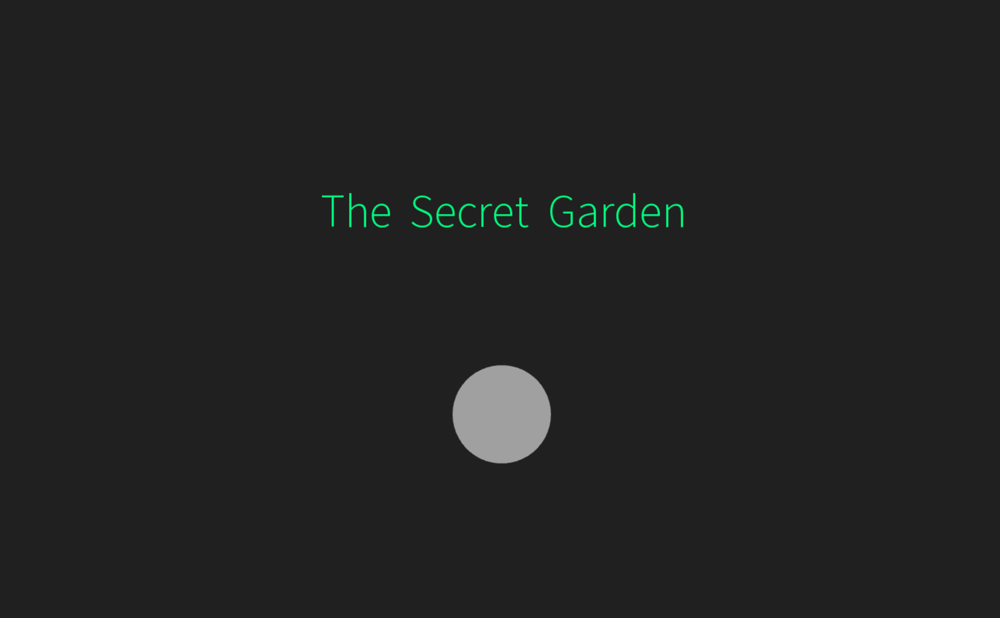
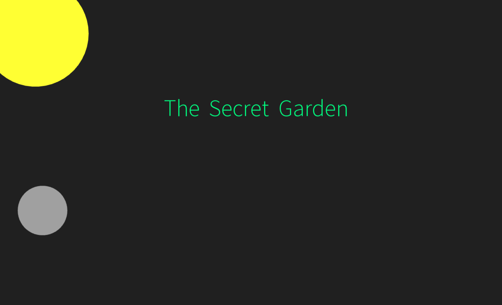
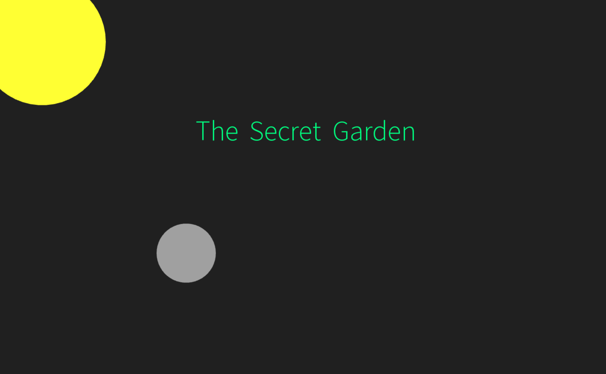
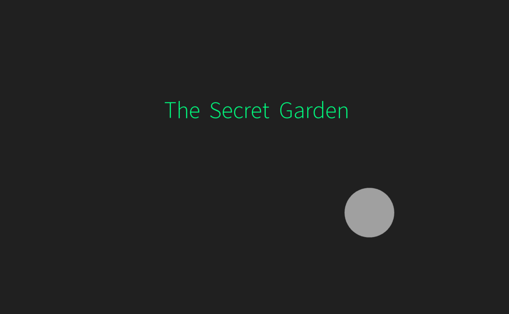

# Assignment 6

### Description of Project 1 Scene

The title of the story, *The Secret Garden*, is displayed in the center of the screen. 

The small circle represents the main character in the story. In the beginning the main character is represented by a grey circle, as she is ill and regains her health along the journey from getting sunshine and being in nature seeking out the secret garden. The grey circle can be moved on the screen using the left and right arrows. 

The sun is represented by the large circle in the top left corner of the screen, which appears and dissapears when the mouse is pressed vs. pressed again. 

### Images 

### Video

