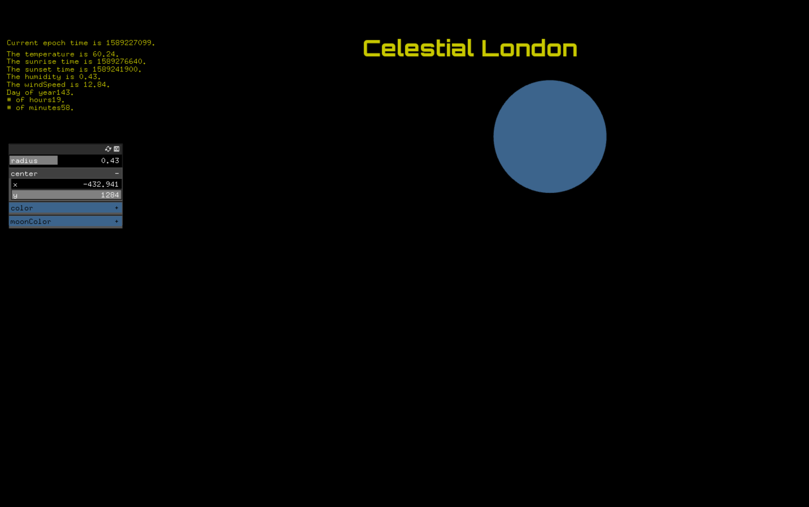
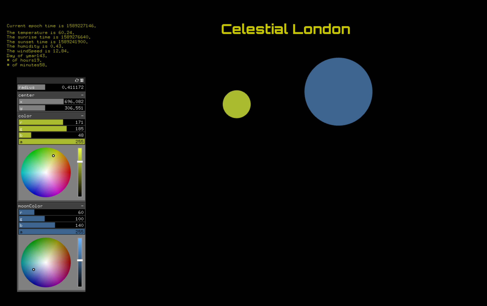
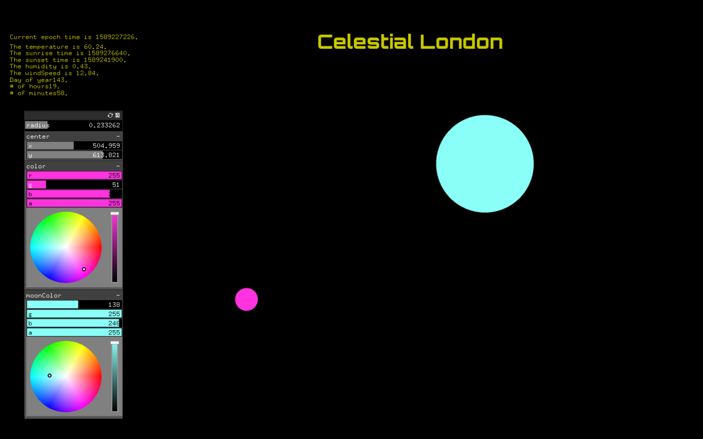
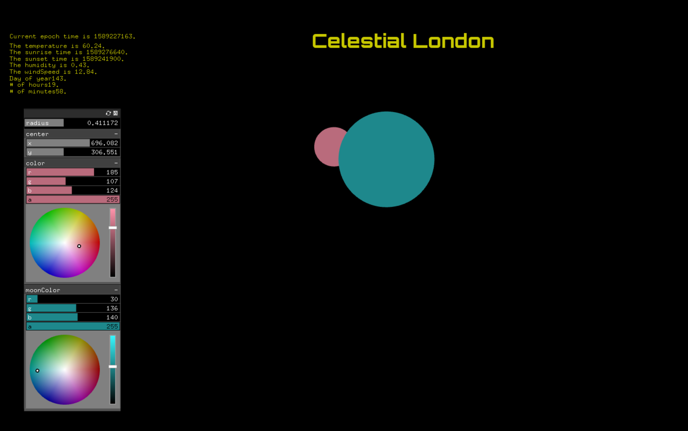
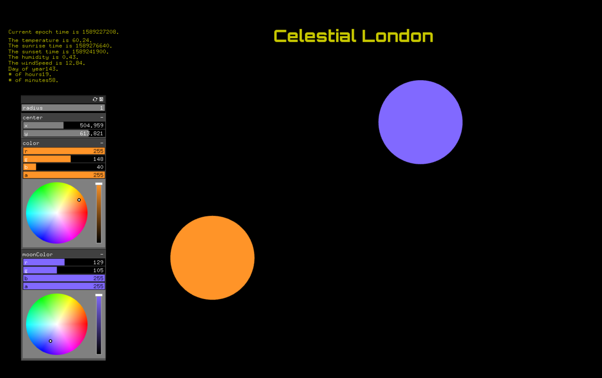
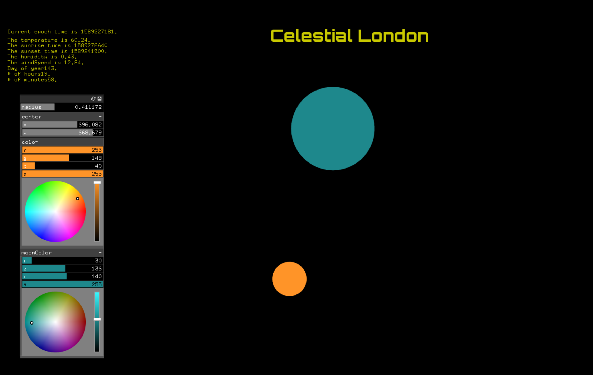

## Project Two: Visualisation of Celestial London

### Project Concept Description

Using Darksky API data, this project reports weather data for London, including the time (in epoch format), sunriseTime, sunsetTime, temperature, humidity, and windSpeed are printed. The current day of the year, hour, and minute are also shown. If the current time is  between Sunset and Sunrise time in London, a moon appears. The moon is orbiting a circular axis and moving horizontally according to the wind speed. Additionally, if the current time is between Sunrise and Sunset, a sun appears. Both the sun and the moon's colors can be adjusted using the color GUI slider. The X and Y coordinates of the sun can be adjusted, along with it's radius.

All of the following values can be changed manually with the GUI panel, and change automatically according to the corresponding API data for each value:

The temperature changes the color.
The humidity changes the radius of the circle.
The windSpeed (multiplied by 100) is shown to effect the moon's horizontal location, as it also orbits in a circle. 

Y = vertical location 
X = horizontal location (Sunrise time) 

The project's ideal audience is anyone who is intrigued by data relating to weather, geography, and astrongy in terms of visualization. It seems like it would be an interesting project for kids to get more interested in science and these kinds of topics. I would like to have created more engaging and dynamic visualizations, so a potential shortfall is the basic shapes and design as opposed to something more artistically advanced, but that is based on my skill level and will grow. 

How could I extrapolate on this idea of visualizing the moon and sun relating to weather in London, and maybe involve more of the solar system, like full constellations, stars, and other planets in an artistic way? 

### Images

### Video

The URL of the YouTube Video: https://www.youtube.com/watch?v=9O_83RU1fMs&t=3s

