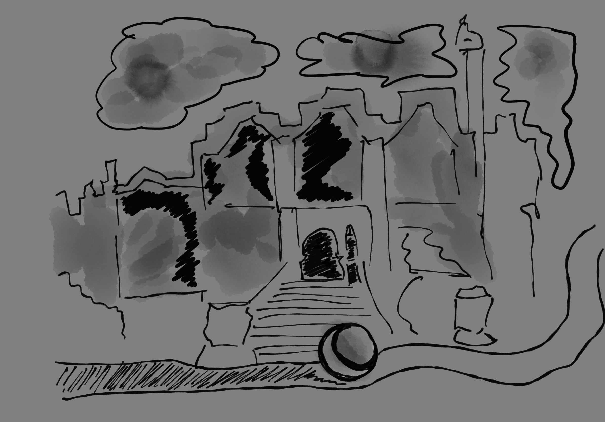
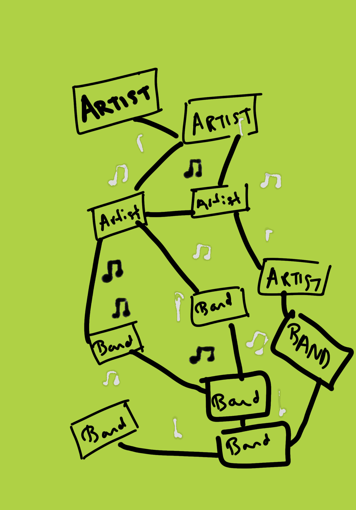
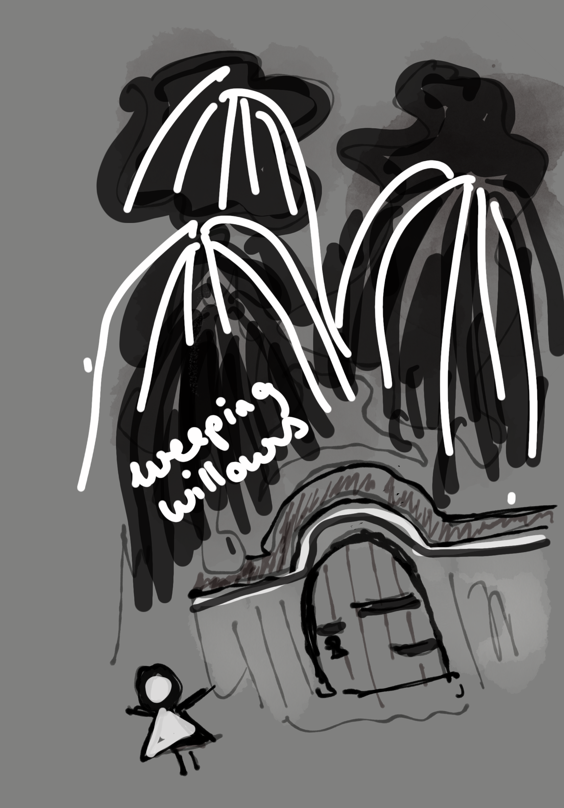
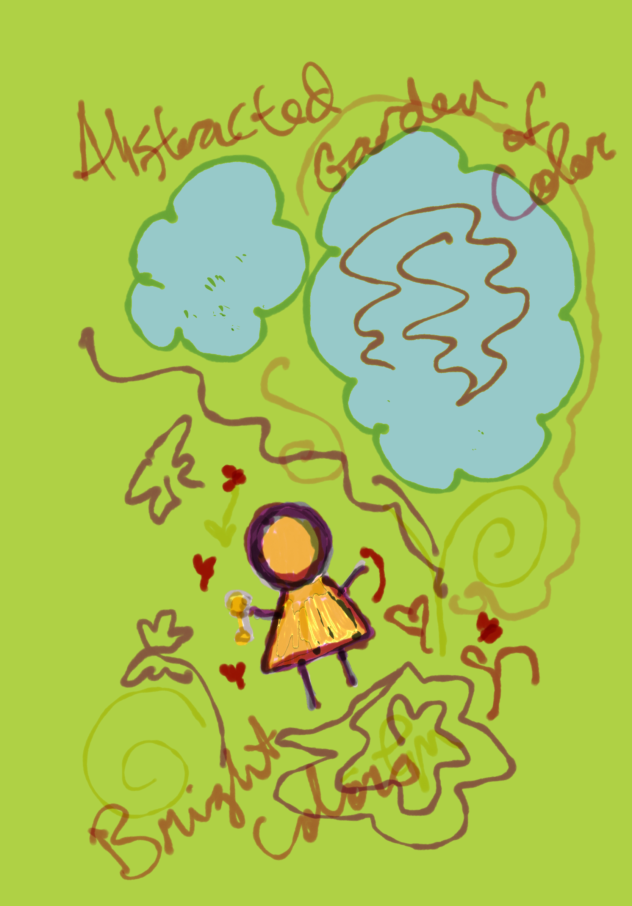

# Assignment 3

Project Conceptual Descriptions & Drawings

## Project 1 : The Secret Garden

An abstracted visualization of the story of The Secret Garden, in a few simple scenes.

The first background is dark with a grey and black color palette, dark clouds, ominous illustration. I want to make the whole project abstract, due to my novice coding skills, so I think it would be interesting to try to tell the story primarily through color and abstract shapes. 

The main character is represented by a circle, which starts out as grey to represent her illness and mood. The circle finds a door/gate scene, and a view through a keyhole reveals a world of colorful abstract shapes. The ominous or minor music playing in the dark grey world transforms to a world of color and uplifting music. 

The circle representing the main character has gone through the gate into the secret garden. There are colorful flowers (abstract shapes) and blue sky there. The main character turns from grey to yellow to show that nature and the garden have healed her. 

_*Who is the user?*_

The user could be a child, or anyone who is interested in an abstract visual telling of a children's story through basic shapes. 

_*What do you want them to experience?*_ 

I want the user to experience the feeling of healing and transformation that the character in The Secret Garden experiences. In the story, the main character and her friend are both ill, and suffering. When they seek out the garden, being in nature helps them begin to heal, and when they finally enter the garden, they are rejuvinated and return to happiness and health. I want the experience of dark, grey colors and minor music to transition to bright, colorful visuals and happy sounding music to express the story. 

_*How will your translation achieve this?*_

I think through an abstract visualization that the main tone and feeling of the story of The Secret Garden can be communicated. The main character, represented by a circle, will change in mood from sad to happy - and this will be shown with a color change from grey to yellow. The surroundings will change from black and grey to colorful , Springtime colors as the music changes from minor to major. 

## Project 2

For Project 2 I want to visually map out relationships and data analytics related to my Spotify listening habits. 

_*Who is the User?*_

Someone interested in seeing data visualization of their playlist analytics or who wants to better understand their music listening habits.

_*What do you want them to experience?*_

The experience of being able to make connections through visual mapping and to be able to see data which is normally not thought about or apparent. 

_*How will your translation achieve this?*_

I will show new relationships and connections relating to music listening and being a fan of different genres by visually showing listening habits. The data visualization could show which artists are listened to most frequently,  as well as songs, and albums, or other data (time of day most listened to) that can be shown.

I don't truly understand what is possible, but it would be nice to be able to click on different items and learn more about them, or have other pieces of data appear in the visualization when you hover or click on an icon.

## Project 3

I would like to do a gamified version of my concept for the first project, which is an abstract artistic interpretation of The Secret Garden. The game would involve the user finding a key of some kind, as well as a gate with a keyhole which they use to open the door to enter the garden.  I would like it to be more about the experience of transforming from a world of grey, with weeping willow trees, and ominous music to one of bright color and upbeat music. 

_*Who is the user?*_

A game player, a kid, anyone who is interested in the story of The Secret Garden illustrated in an abstracted way. 

_*What do you want them to experience?*_

The novelty of finding a key, and finding the garden. I want there to be an element of hunting and finding easter eggs. The transition from grey darkness to colorful Springtime, flowers and the garden and transforming the characters level of health from depleted to healthy along with showing that through changing colors from grey to bright colors.

_*How will your translation achieve this?*_

Maybe I could incorporate illustrations as images for the background images to illustrate the different scenes and tonal shifts. In the dark world scenes, before the character finds the garden, I'd love to incorporate images of weeping willows, or black and white photography somehow with illustration. 

---

Example of four primative shapes:

! [img](Images/Assignment3.png)

